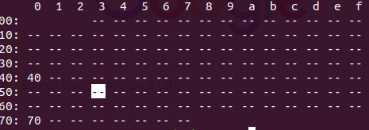

# ros-pca9685-jetXavNX
This is the PCA9685 package for the ROS Melodic using the Jetson Xavier NX using C++. All credit goes to Dheera for his work on https://github.com/dheera/ros-pwm-pca9685. This is a perfect package to be used with Donkey Car-esque 
projects.

## Donkey Car Enthusiasts
I have not used the Donkey Car App for this configuration, but I have made this board compatible with Jetson Xavier if you would like to customize your Donkey Car using ROS.

## Pinout
In order to configure the package correctly, follow the correct pinout for wiring the PCA9685 to the Jetson Xavier NX. Here is a reference pinout for your convenience: https://www.jetsonhacks.com/nvidia-jetson-xavier-nx-gpio-header-pinout/

| Jetson Xavier NX | PCA9685 Adafruit |
|------------------|------------------|
| Pin 2 - 5.0V     |  VCC           |
| Pin 6 - GND      |   GND           |
| Pin 27 - SDA (I2C Bus 1) | SDA     |
| Pin 28 - SCL (I2C Bus 1) | SCL     |

Ensure that the pins above are wired correctly to the PCA9685. 

Most of the configuration for your PCA9685 will be located in **src/pca9685_activity.cpp** It is recommended to keep the default address at 0x40. I have most of the configuration set up for you in this package for DonkeyCar.  

## Is your PCA9685 communicating with I2C?
On the Jetson Xavier, your SDA and SCL pins will connected to Bus 1 of I2C. If you did not wire to the specified SDA/SCL pins above, your PCA9685 module will not work. To check if your address is being read, type in terminal:

**sudo i2cdetect -r -y 1**

and you should see a 40 output in the following image: 

If not, you need to check your wiring again.

## Understanding the parameters
To understand the parameters and setup, I will send you to this link: https://github.com/dheera/ros-pwm-pca9685 Dheera is the owner of the code and deserves credit, give him a follow as well if this helped you.

## Running in ROS
After building and sourcing your package and running **roscore**, execute the following line, in a seperate terminal, which will publish a **/command** topic:

**rosrun pwm_pca9685 pca9685_node**

## Testing the motors
Please reference  https://github.com/dheera/ros-pwm-pca9685 to understand the parameters. Use the following to publish commands to the **/command** topic and test your servos. In my configuration, I have the driving servo connected to Channel 0 and steering servo connected to Channel 1. This is only an example for my configuration and how I setup my channels, use this as a reference:

**rostopic pub -1 /command std_msgs/Int32MultiArray -- '{data: [5500,7800,-1,-1,-1,-1,-1,-1,-1,-1,-1,-1,-1,-1,-1,-1]}'**

## FOR DONKEY CAR MODELS ONLY, OTHER SETUPS DIFFER
Here is my setup for Duty Cycles on the Donkey Car. I have Channel 0 as driving and Channel 1 as steering. You can connect your servos however you want, but I just prefer it this way:

#### Channel 0 (Driving) :
| Duty Cycle | Action |
|------------------|------------------|
| 5550 | Activate the Motor/Stop |
| 7800 | Max Forward Speed|

**You must activate the motor first in order to drive, you will hear a beep when you run the duty cycle correctly*

#### Channel 1 (Steering) :

| Duty Cycle | Action |
|------------------|------------------|
| 7600     |  Left (Max)           |
| 5500      | Center           |
| 2800 | Right(Max)  |
